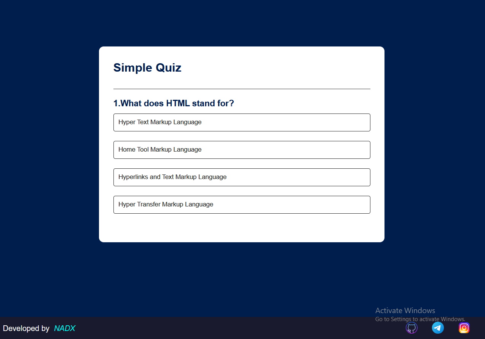
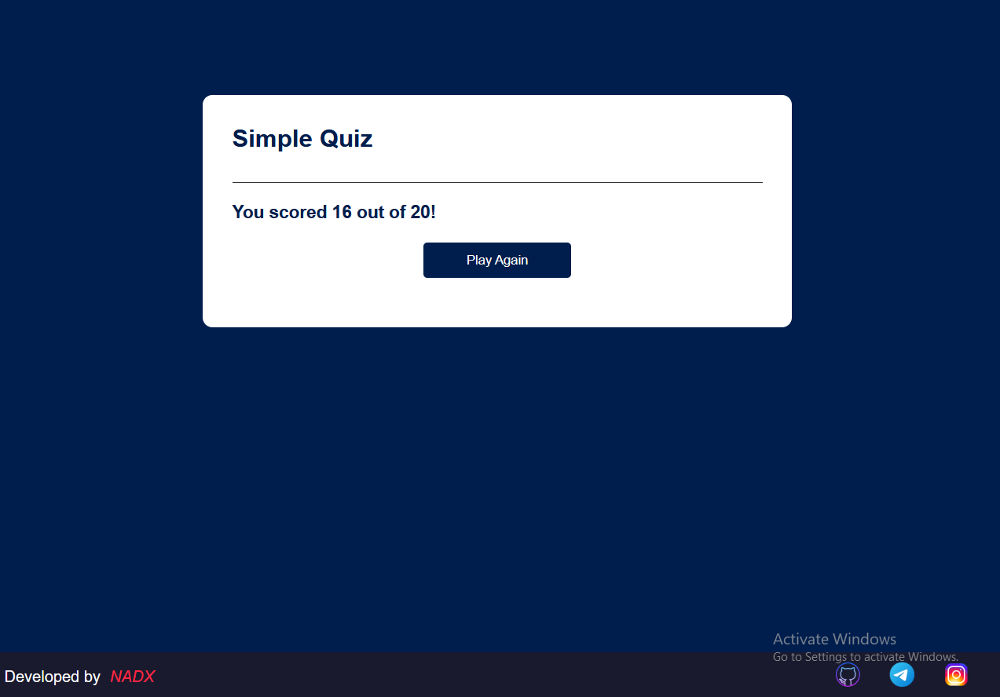

# 🧠 Simple Quiz App

A fun and interactive quiz web application built using **HTML**, **CSS**, and **JavaScript**. Users can test their knowledge by answering multiple-choice questions. Lightweight, responsive, and easy to customize!

---

## 🚀 Features

- 🎯 **Answer Questions** – Choose the correct answer from multiple choices.
- 📊 **Score Tracking** – See your score instantly after finishing the quiz.
- 🔁 **Replay Option** – Try the quiz again for a better score.
- 📱 **Responsive Design** – Works well on all screen sizes.

---

## 🖼️ Preview


 

---

## 💡 How It Works

- The app displays one question at a time with four answer choices.
- Click on an option to proceed to the next question.
- At the end, your score is displayed.
- The quiz can be reset and played again.

---

## 🛠️ Built With


 ---

## 🌐 Live Demo

👉 [Try the Live Quiz App](https://nadx-quiz-app.netlify.app/)  


---

## 📂 Folder Structure

```Quiz-App/
├── index.html
├── style.css
├── quizApp.js
└── images/
| ├── preview.png
| └── preview2.png
```

---

## 📌 License

This project is open source and free to use.

---

> Made by **NADX**
 
Feel free to reach out on [Telegram](https://t.me/nisimp)
